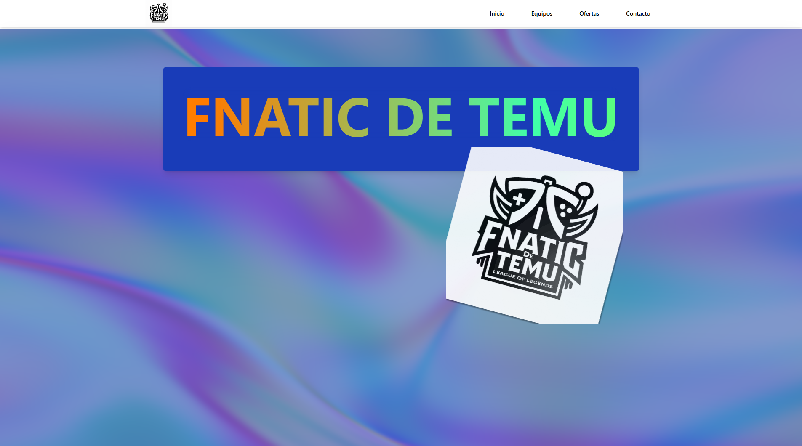
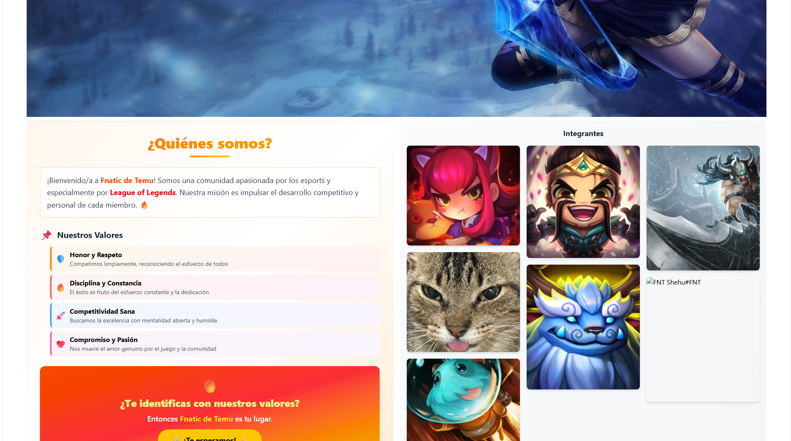

# 🎮 Fnatic de Temu

> **Página web oficial de la comunidad Fnatic de Temu - League of Legends**

Una aplicación web moderna construida con **Astro**, **React** y **Tailwind CSS v3** que presenta a nuestra comunidad competitiva de League of Legends con un diseño interactivo, efectos visuales avanzados y experiencia completamente responsiva.


## 📸 Vista Previa


</br>
</br>



*Vista principal de la aplicación mostrando el landing hero con efectos iridiscentes, navegación responsiva y galería interactiva de integrantes del equipo*

---

## 🌟 Características Principales

### ✨ **Diseño Moderno e Interactivo**
- **Landing hero** con efectos iridiscentes y shaders WebGL personalizados
- **Navegación responsiva** con menús desplegables y transiciones suaves
- **Layout adaptativo** con paneles redimensionables para desktop
- **Galería tipo Pinterest** con información detallada de cada integrante
- **Carousel dinámico** con banners de campeones icónicos de League of Legends

### 🎯 **Componentes Destacados**
- **Hero section** con efectos visuales avanzados y texto con gradiente animado
- **Sistema de navegación** completo con dropdown menus y versión móvil
- **Panel informativo** con valores del equipo y call-to-action
- **Galería interactiva** con cards profesionales para cada miembro del equipo
- **Carousel de banners** con navegación intuitiva y diseño responsivo

### 🛠️ **Tecnologías de Vanguardia**
- [Astro 5.12](https://astro.build/) - Framework web moderno con Island Architecture
- [React 19.1](https://reactjs.org/) - Biblioteca de UI con las últimas características
- [Tailwind CSS v4](https://tailwindcss.com/) - Framework CSS de última generación
- [shadcn/ui](https://ui.shadcn.com/) - Componentes UI premium
- [React Bits](https://www.reactbits.dev/) - Componentes interactivos avanzados
- [GSAP](https://gsap.com/) - Animaciones de alto rendimiento
- [OGL](https://github.com/oframe/ogl) - Biblioteca WebGL ligera para efectos visuales

---

## 🚀 Instalación y Configuración

### **Prerrequisitos**
- Node.js 18+ 
- npm, yarn o pnpm

### **1. Clonar el repositorio**
```bash
git clone https://github.com/Azpy/fnatic-de-temu.git
cd fnatic-de-temu
```

### **2. Instalar dependencias**
```bash
npm install
# o
yarn install
# o
pnpm install
```

### **3. Ejecutar en desarrollo**
```bash
npm run dev
# o
yarn dev
# o
pnpm dev
```

La aplicación estará disponible en `http://localhost:4321`

### **4. Construir para producción**
```bash
npm run build
# o
yarn build
# o
pnpm build
```

---

## 📁 Estructura del Proyecto

```
FnaticDeTemu/
├── src/
│   ├── components/
│   │   ├── ui/                     # Componentes shadcn/ui
│   │   │   ├── carousel.tsx        # Carousel con Embla
│   │   │   ├── masonry.jsx         # Galería tipo Pinterest
│   │   │   ├── resizable.tsx       # Paneles redimensionables
│   │   │   ├── Iridescence.jsx     # Efectos WebGL
│   │   │   ├── GradientText.jsx    # Texto con gradiente animado
│   │   │   └── button.tsx          # Botones estilizados
│   │   ├── NavigationMenuDemo.tsx  # Navegación principal + Landing
│   │   ├── ResizableExample.jsx    # Layout principal con paneles
│   │   └── Main.astro             # Componente wrapper
│   ├── pages/
│   │   └── index.astro            # Página principal
│   ├── layouts/
│   │   └── main.astro             # Layout base
│   └── styles/
│       └── global.css             # Estilos globales con Tailwind v4
├── public/                        # Recursos estáticos
│   ├── logoHeader.png             # Logo principal del equipo
│   ├── Ashe.jpg                   # Banners de campeones
│   ├── Tryndamere.webp           
│   ├── Jinx.jpg                   
│   ├── Draven.jpg                 
│   ├── Zilean.jpg                 
│   └── [integrantes]/             # Fotos del equipo
├── vercel.json                    # Configuración de despliegue
└── package.json                   # Dependencias y scripts
```

---

## 🎨 Componentes Principales

### **NavigationMenuDemo.tsx**
Componente integral que incluye:
- **Sistema de navegación** responsivo con dropdown menus
- **Landing hero** con efectos iridiscentes y WebGL
- **Texto con gradiente** animado para el título principal
- **Versión móvil** optimizada con menú hamburguesa

```tsx
// Ejemplo de configuración del efecto iridiscente
<Iridescence 
  className="absolute inset-0 w-full h-full"
  color={[0.5, 0.6, 0.8]}        // Color RGB personalizable
  mouseReact={true}               // Reactividad al mouse
  amplitude={0.1}                 // Intensidad del efecto
  speed={1.3}                     // Velocidad de animación
/>
```

### **ResizableExample.jsx**
Layout principal adaptativo con:
- **Panel superior (35%)**: Carousel de banners de campeones
- **Panel inferior izquierdo**: Información del equipo y valores fundamentales
- **Panel inferior derecho**: Galería profesional de integrantes
- **Responsive design**: Se adapta automáticamente a dispositivos móviles

### **Galería de Integrantes**
Implementación elegante con:
- **Cards profesionales** con información detallada de cada miembro
- **Roles diferenciados** con iconografía específica (ADC, Support, Jungle, etc.)
- **Hover effects** suaves con transiciones CSS avanzadas
- **Enlaces externos** a perfiles de OP.GG y redes sociales
- **Diseño tipo Pinterest** con alturas variables para dinamismo visual

```jsx
// Estructura de datos de integrantes
const items = [
  {
    id: "coach-sinag",
    img: "/Sinag.jpg",
    url: "https://www.twitch.tv/sinag",
    height: 400,
    playerInfo: {
      name: "Sinag",
      role: "Coach",
      rank: "Challenger",
      description: "Coach principal del equipo"
    }
  }
  // ... más integrantes con información completa
]
```

### **Carousel de Campeones**
Banner rotativo con:
- **5 campeones icónicos** de League of Legends
- **Navegación intuitiva** con controles centrados
- **Transiciones suaves** y optimización de rendimiento
- **Responsive design** adaptado a todos los dispositivos

---

## 🎯 Diseño y Experiencia de Usuario

### **Versión Desktop**
- **Header fijo** con navegación completa y dropdown menus
- **Landing hero** a pantalla completa con efectos WebGL
- **Layout de 3 paneles** redimensionables para máxima flexibilidad
- **Animaciones fluidas** en todas las interacciones

### **Versión Móvil**
- **Header compacto** con menú hamburguesa elegante
- **Hero responsivo** con texto escalable automáticamente
- **Layout vertical** optimizado sin paneles redimensionables
- **Touch interactions** optimizadas para dispositivos táctiles

### **Efectos Visuales Avanzados**
- **Shaders WebGL** personalizados para el fondo iridiscente
- **Gradientes animados** en textos principales
- **Hover effects** profesionales en toda la interfaz
- **Transiciones CSS** optimizadas para rendimiento

---

## 🚀 Despliegue y Producción

### **Vercel (Configurado)**
El proyecto está optimizado para despliegue automático:

```json
// vercel.json
{
  "framework": "astro",
  "buildCommand": "npm run build",
  "outputDirectory": "dist"
}
```

### **Optimizaciones Incluidas**
- **Island Architecture** de Astro para hidratación selectiva
- **Bundle splitting** automático para mejor performance
- **Compresión de assets** optimizada
- **Lazy loading** de componentes pesados

---

## 🛠️ Scripts de Desarrollo

```bash
npm run dev          # Servidor de desarrollo con hot reload
npm run build        # Construir para producción con optimizaciones
npm run preview      # Preview de la build de producción
npm run astro        # CLI de Astro para comandos adicionales
```

---

## 🤝 Contribuir

### **Guía de Contribución**
1. **Fork** el repositorio
2. Crea una **rama feature** (`git checkout -b feature/nueva-caracteristica`)
3. **Commit** tus cambios (`git commit -m 'feat: agregar nueva característica'`)
4. **Push** a la rama (`git push origin feature/nueva-caracteristica`)
5. Abre un **Pull Request** con descripción detallada

### **Convenciones de Código**
- **TypeScript** para tipado estático
- **Prettier** para formateo automático
- **Conventional commits** para mensajes estructurados
- **ESLint** para calidad de código

---

## 📞 Contacto y Comunidad

### **Enlaces Principales**
- **🎮 Discord**: [Únete a nuestro servidor](https://discord.gg/A68XyCQVHQ)
- **💻 GitHub**: [Repositorio del proyecto](https://github.com/Azpy/fnatic-de-temu)

---

## 📄 Licencia

Este proyecto está bajo la **Licencia MIT**. Ver el archivo [LICENSE](LICENSE) para más detalles.

---

## 🏷️ Dependencias Principales

```json
{
  "dependencies": {
    "@astrojs/react": "^4.3.0",
    "@radix-ui/react-slot": "^1.2.3",
    "@tailwindcss/vite": "^4.1.11",
    "astro": "^5.12.4",
    "embla-carousel-react": "^8.6.0",
    "gsap": "^3.13.0",
    "lucide-react": "^0.532.0",
    "ogl": "^1.0.11",
    "react": "^19.1.1",
    "react-dom": "^19.1.1",
    "react-resizable-panels": "^3.0.3",
    "tailwindcss": "^4.1.11"
  }
}
```

---

<div align="center">

## 🔥 **Desarrollado con pasión por la comunidad de Fnatic de Temu** 🔥

### *¡Únete a nosotros en la Grieta del Invocador!*

[](https://discord.gg/A68XyCQVHQ)
[](https://github.com/Azpyrx/FnaticDeTemu)
[](https://fnatic-de-temu.vercel.app)

---

**⚔️ Honor • Disciplina • Competitividad • Pasión ⚔️**

</div>
